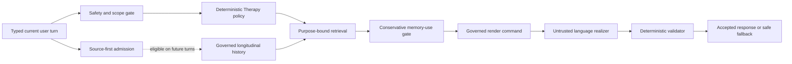

# Conundrum Thomas V2

**A deterministic, evidence-governed architecture for a local-first
conversational system.**

Conundrum Thomas V2 explores a deliberately narrow thesis:

> **Thomas decides what to say. The renderer decides how to say it.**

Mode, safety, therapeutic behavior, memory selection, epistemic status, and
response limits belong to typed, inspectable policy. A language model—if one is
admitted in a future phase—may only realize an already-authorized meaning and
cannot write evidence, search memory, choose a route, or bypass validation.

> [!IMPORTANT]
> This repository currently contains qualified architecture, deterministic
> Kotlin policy, and synthetic test infrastructure. The Android application is
> a minimal Compose shell. There is no production conversational integration,
> production personal-data store, or admitted language model.

> [!WARNING]
> This project is not a medical device, clinical service, crisis service, or
> production therapy system. Do not use the current repository for clinical
> care or with real personal or psychological data.

## Why this architecture exists

A fluent response is not necessarily a justified response. Thomas separates
behavioral authority from language generation so important decisions remain
reviewable and testable:

- procedure precedes generation;
- safety is an independent authority;
- user-authored sources remain primary evidence;
- interpretations remain distinct from facts;
- private, corrected, contradicted, and uncertain material stays visibly so;
- memory is retrieved for a declared purpose and cannot choose policy;
- assistant output cannot become evidence about the user;
- invalid realization falls back without changing the governed decision.

The result is intentionally less autonomous than a conventional chatbot and
more explicit about what each component is allowed to know, decide, and write.

## Three distinct modes

| Mode | Purpose | Governing boundary |
| --- | --- | --- |
| **Journal** | Capture life as the user records it | Source-first; silence is the default; optional reflection is bounded |
| **Biographer** | Investigate structurally incomplete history | One deterministic target and at most one non-leading question |
| **Therapy** | Address a present concern through governed policy | Current safety first, deterministic route second, historical memory last |

These names describe product modes and authority boundaries. They do not assert
diagnosis, clinical validation, or professional care.

## Qualified longitudinal Therapy flow

The following pipeline exists in synthetic qualification. It is not wired into
the Android application:



The order is architectural: historical memory cannot alter safety, route, or
technique selection, and the current turn cannot retrieve itself as history.

## Current implementation status

| Capability | Current state |
| --- | --- |
| Mode, provenance, ontology, safety, and ordinary Therapy policy | Pure Kotlin, deterministic, qualification-authorized |
| Longitudinal evidence, revisions, corrections, privacy, and identity | Typed domain plus synthetic append-only qualification store |
| Language-to-evidence formation | Conservative, source-grounded, deterministic qualification path |
| Journal capture | Synthetic source-first engine; default `NO_RESPONSE` |
| Biographer coverage | Synthetic deterministic coverage map and one-question authority |
| Retrieval and context packets | Read-only, purpose-bound, correction-aware, budgeted |
| Longitudinal Therapy composition | Route-first integration with at most one ordinary memory reference |
| Language rendering | Typed command, deterministic reference realizer, adversarial validator tests, safe fallback |
| Android application | Minimal Compose shell only |
| Production model and personal-data storage | **Not admitted** |

The sealed CT-V2-13 qualification recorded 872 tests with zero failures, errors,
or skips; 347 executed build tasks; zero lint errors or fatals; and successful
debug and unsigned-release APK assembly. See the
[qualification record](docs/qualification/CT-V2-13-QUALIFICATION.md) for the
scope and limitations behind those numbers.

## Quick start

### Prerequisites

The recorded qualification environment uses:

- Git;
- JDK 25 for the Gradle daemon;
- Android SDK Platform 37;
- the checked-in Gradle 9.5 wrapper.

The project emits Java/Kotlin 11-compatible bytecode. Android Studio can manage
the SDK path through the ignored `local.properties` file. The first build
requires network access to resolve declared dependencies.

### Clone and verify

```bash
git clone https://github.com/primalfunk/conundrum_thomas.git
cd conundrum_thomas
./gradlew clean build lint generateRuntimeProvenanceDb --rerun-tasks --console=plain
```

From PowerShell on Windows:

```powershell
git clone https://github.com/primalfunk/conundrum_thomas.git
Set-Location conundrum_thomas
.\gradlew.bat clean build lint generateRuntimeProvenanceDb --rerun-tasks --console=plain
```

The provenance task builds an ignored, synthetic SQLite database from tracked
migrations and seeds. It is build and qualification infrastructure, not a
production user-data store.

To verify that Android Studio and command-line Git share the canonical project
root on Windows:

```powershell
.\tools\verify-canonical-git-root.ps1
```

## Repository map

| Path | Responsibility |
| --- | --- |
| [`app/`](app/) | Minimal Android/Compose application shell |
| [`thomas/domain/`](thomas/domain/) | Shared mode and rendering authority contracts |
| [`thomas/engine/`](thomas/engine/) | Deterministic ordinary Therapy policy |
| [`thomas/safety/`](thomas/safety/) | Independent safety and scope permit |
| [`thomas/longitudinal*/`](thomas/) | Evidence domain, admission, and synthetic qualification store |
| [`thomas/journal/`](thomas/journal/) | Journal commit and bounded-response contracts |
| [`thomas/biographer/`](thomas/biographer/) | Coverage map, target selection, and question authority |
| [`thomas/retrieval/`](thomas/retrieval/) | Read-only deterministic historical retrieval |
| [`thomas/context-packet/`](thomas/context-packet/) | Bounded, typed, purpose-specific context |
| [`thomas/therapy-longitudinal/`](thomas/therapy-longitudinal/) | Route-first Therapy and memory composition |
| [`thomas/language-renderer/`](thomas/language-renderer/) | Untrusted realization boundary, validation, and fallback |
| [`platform/`](platform/) | Unwired Android adapter boundaries |
| [`qualification/`](qualification/) | Synthetic end-to-end and adversarial qualification |
| [`provenance/`](provenance/) | Governed source schema, migrations, and synthetic seeds |
| [`docs/`](docs/) | Architecture, ADRs, policies, risks, phase records, and qualification evidence |

The compile-enforced dependency graph and authority rules are documented in
[`docs/MODULE-BOUNDARIES.md`](docs/MODULE-BOUNDARIES.md).

## Start with these documents

- [Architecture](docs/CONUNDRUM-THOMAS-V2-ARCHITECTURE.md)
- [Mode authority contract](docs/THOMAS-MODE-AUTHORITY-CONTRACT.md)
- [Module boundaries](docs/MODULE-BOUNDARIES.md)
- [Architectural decision records](docs/adr/README.md)
- [Risk register](docs/RISK-REGISTER.md)
- [Latest renderer boundary](docs/CT-V2-13-GOVERNED-LANGUAGE-RENDERER.md)
- [Latest qualification evidence](docs/qualification/CT-V2-13-QUALIFICATION.md)
- [Forward development plan](docs/planning/CONUNDRUM-THOMAS-V2-FORWARD-DEVELOPMENT-PLAN.md)
- [V1 migration register](migration/v1-component-register.json)

V1 code, binaries, models, and repositories are not dependencies. Every one of
the 24 inventoried V1 components remains denied unless separately admitted
through the governed migration register.

## Privacy and repository hygiene

This public repository must remain synthetic-only:

- never commit real Journal entries, Biographer answers, Therapy conversations,
  profile data, recordings, source excerpts, credentials, signing keys, model
  artifacts, generated databases, context-packet dumps, or rendered-response
  logs;
- do not place secrets in tracked Gradle configuration;
- keep private or rights-restricted source material outside Git;
- treat assistant responses and renderer history as operational artifacts, not
  evidence;
- preserve `android:allowBackup="false"` until a separately governed
  production data lifecycle exists.

The root [`.gitignore`](.gitignore) encodes these boundaries. Safe example
configuration may be tracked; populated local configuration may not.

## Working on the project

Before changing a governed boundary:

1. Read the relevant authority contract and ADR.
2. Preserve compile-time dependency direction.
3. Add deterministic qualification for permitted and prohibited behavior.
4. Use synthetic data only.
5. Run the complete qualification command.
6. Record limitations without converting qualification into a production,
   clinical, privacy, or security claim.

A sophisticated output is not evidence that an authority boundary is correct.
In this repository, behavior is accepted because its provenance, policy,
failure handling, and tests are inspectable.

## License and attribution

Copyright 2026 primalfunk.

Conundrum Thomas V2 is licensed under the
[Apache License, Version 2.0](LICENSE). Distributed derivative works must
preserve the attribution notices in [`NOTICE`](NOTICE) as required by the
license.

**Attribution:** Conundrum Thomas V2 by
[`primalfunk`](https://github.com/primalfunk).
